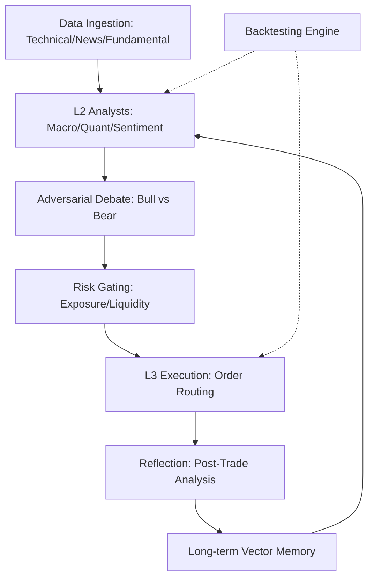

# Feature Landscape: Multi-Agent Financial Analysis Swarms (Quantum Swarm)

**Domain:** Quantitative Finance / Multi-Agent Systems (MAS)
**Researched:** 2025-03-05
**Overall Confidence:** HIGH

## Table Stakes

Features users and institutional traders expect as a minimum baseline. Missing these makes the system feel like a "toy" or unsafe for capital.

| Feature | Why Expected | Complexity | Notes |
|---------|--------------|------------|-------|
| **Role Specialization** | Financial analysis is too broad for one model; requires specialized "experts" (Macro, Quant, Risk). | Medium | Essential to prevent "generalist hallucinations." |
| **Hierarchical Architecture** | Prevents "coarse-grained" errors by separating data ingestion (L1), analysis (L2), and execution (L3). | High | Common in 2024-2025 SOTA systems (e.g., TradingAgents). |
| **Multi-Source Data Integration** | Must combine Technical (OHLCV), Fundamental (SEC), and Sentiment (News/Social). | Medium | Using only one data type leads to high blind-spot risk. |
| **Backtesting with "Friction"** | Realistic modeling of slippage, commissions, and order-handling latency. | Medium | Frictionless backtests are the #1 cause of "paper millionaires" failing live. |
| **Audit Trail (Explainability)** | Every trade signal must have a clear chain of reasoning: which agent suggested it and why. | Low | Critical for trust and regulatory compliance (XAI). |
| **Basic Risk Gating** | Hard stop-losses, position sizing constraints, and exposure limits. | Medium | Must be a separate agent/module, not part of the "trader" logic. |

## Differentiators

Features that set Quantum Swarm apart from standard trading bots and basic MAS implementations.

| Feature | Value Proposition | Complexity | Notes |
|---------|-------------------|------------|-------|
| **Adversarial Debate** | "Bull" vs. "Bear" agents argue a thesis before execution to uncover hidden risks. | High | Reduces "Consensus Bias" and groupthink common in LLM swarms. |
| **Self-Correction & Reflection** | Agents analyze their own failed trades (simulated/live) and update a "Lessons Learned" memory. | High | Essential for adapting to market regime shifts. |
| **Regime-Aware Memory** | Long-term vector memory to recognize current market conditions vs. historical patterns (e.g., "Bull market 2021"). | High | Prevents using 2024 strategies in 2008-style crashes. |
| **Hybrid Reasoning Engine** | Combines LLM heuristic logic with Reinforcement Learning (RL) or statistical optimization. | High | Best of both worlds: LLM for context, RL for precise order-flow. |
| **Simulated "Dry Run" Mode** | Real-time execution in a sandboxed environment with identical agentic logic. | Medium | Standard in 2025 (e.g., QuantAgents framework). |
| **Agentic Verification** | A "Checker" agent that validates the final execution plan against the original strategy intent. | Medium | Prevents "Deceptive Success" (agents claiming success on failed tasks). |

## Anti-Features

Features to explicitly NOT build to avoid common catastrophic failure modes.

| Anti-Feature | Why Avoid | What to Do Instead |
|--------------|-----------|-------------------|
| **Monolithic "Alpha" Agent** | Prone to reasoning loops, high latency, and massive hallucinations in complex domains. | Use specialized L2 domain managers (Macro, Quant). |
| **Direct LLM Order Execution** | LLMs are bad at math and lack real-time risk awareness; too slow for execution logic. | Use a dedicated L3 executioner with statistical risk gates. |
| **Infinite Reasoning Loops** | Agents often repeat steps without state change, burning API credits and missing trade windows. | Implement "Max Step" limits and state-change verification. |
| **Consensus-Only Voting** | Swarms often conform to the majority, leading to extreme "Group Polarization." | Use Adversarial Debate (weighted dissent) instead of simple voting. |
| **High-Frequency Trading (HFT)** | LLM latency (seconds) makes them unsuitable for sub-second execution. | Focus on "Intraday" to "Swing" timeframes where reasoning matters. |

## Feature Dependencies

- **Analysis (L2)** requires **Data (L1)**.
- **Debate** requires multiple **L2 Analysts**.
- **Execution (L3)** is strictly downstream of **Risk Gating**.
- **Regime Awareness** requires **Long-term Memory** and **Post-Trade Reflection**.

## MVP Recommendation

Prioritize the "Safety First" Multi-Agent core:
1. **L2 Role Specialization:** At least one Macro and one Quant agent.
2. **L3 Risk Gating:** A hard-coded or strictly statistical risk module.
3. **Audit Trail:** Basic reasoning log for every trade signal.
4. **Realistic Backtesting:** The core differentiator for a viable product.

Defer:
- **Adversarial Debate:** Start with a "Lead Analyst" model, add debate in v2.
- **RL Optimization:** Use standard statistical models for execution initially.

## Sources

- **"Year of the Agent" (2025) Trends:** osintteam.blog, towardsai.net (High Confidence)
- **TradingAgents Framework:** cyberarctica.com / EMNLP 2024 (High Confidence)
- **QuantAgents Simulated Trading:** arXiv 2025 (Medium Confidence)
- **MAST Framework (Pitfalls):** plainenglish.io (High Confidence)
- **Common MAS Failure Modes:** medium.com/towards-data-science (Medium Confidence)
